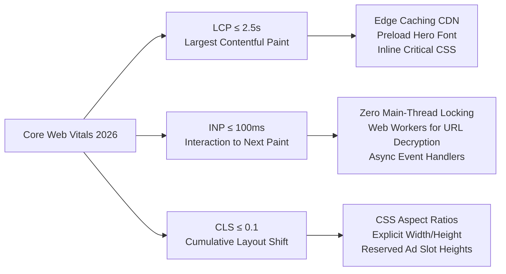
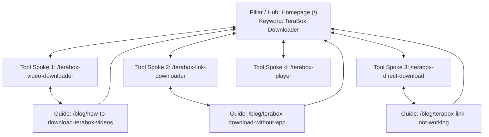

# TeraLinkGrabber — Complete 2026 SEO Master Blueprint & Best Practices Guide

> **Project Target:** TeraLinkGrabber.com (High-Volume Web Utility & TeraBox Downloader)  
> **Documentation Scope:** Technical SEO, Core Web Vitals, On-Page Architecture, Structured Data, Generative Engine Optimization (GEO), Content Intent, Link Building, Security, and Algorithmic Compliance.  
> **Synthesized From:** 20 targeted research investigations into cutting-edge search engine algorithms, Google Core Updates, and top-ranking web utility competitors.

---

## Table of Contents
1. [The 20 Research Pillars & Core Intelligence](#1-the-20-research-pillars--core-intelligence)
2. [Technical SEO & Crawl Budget Governance](#2-technical-seo--crawl-budget-governance)
3. [Core Web Vitals & Web Performance Engineering](#3-core-web-vitals--web-performance-engineering)
4. [On-Page SEO & Content Hierarchy Standards](#4-on-page-seo--content-hierarchy-standards)
5. [Structured Data & JSON-LD Schemas (Copy-Paste Ready)](#5-structured-data--json-ld-schemas-copy-paste-ready)
6. [Internal Linking & Topic Cluster Architecture](#6-internal-linking--topic-cluster-architecture)
7. [Search Intent, Query Fan-Out & Dwell-Time Optimization](#7-search-intent-query-fan-out--dwell-time-optimization)
8. [Generative Engine Optimization (GEO) for AI Overviews & Chatbots](#8-generative-engine-optimization-geo-for-ai-overviews--chatbots)
9. [Mobile-First UX & Touch Target Requirements](#9-mobile-first-ux--touch-target-requirements)
10. [Media, Image & Video SEO](#10-media-image--video-seo)
11. [Ad Placement Without Damaging Core Web Vitals](#11-ad-placement-without-damaging-core-web-vitals)
12. [Security, HTTPS & HTTP Header Hardening](#12-security-https--http-header-hardening)
13. [International SEO & Hreflang Configuration](#13-international-seo--hreflang-configuration)
14. [Canonicalization & Faceted URL Cleanup](#14-canonicalization--faceted-url-cleanup)
15. [White-Hat Backlink Acquisition for Utility Tools](#15-white-hat-backlink-acquisition-for-utility-tools)
16. [Google Search Console (GSC) & Continuous CTR Optimization](#16-google-search-console-gsc--continuous-ctr-optimization)
17. [Legal Compliance, Safe Harbor & Avoiding Google Algorithmic Demotions](#17-legal-compliance-safe-harbor--avoiding-google-algorithmic-demotions)
18. [Actionable Implementation Checklist for TeraLinkGrabber](#18-actionable-implementation-checklist-for-teralinkgrabber)

---

## 1. The 20 Research Pillars & Core Intelligence

To construct this master guide, 20 distinct SEO queries were researched across technical, architectural, behavioral, and niche competitor vectors:

| # | Investigation Focus | Key Finding Applied to TeraLinkGrabber |
|---|---|---|
| **1** | Modern Technical SEO Checklist | Google prioritizes clean initial HTML rendering over heavy client-side JavaScript for metadata and core content. |
| **2** | Core Web Vitals (LCP, INP, CLS) | INP (< 200ms, ideally < 100ms) has replaced FID; input parsing and event handlers must yield to the main thread. |
| **3** | Utility Tool Website SEO | Tools endure AI search disruptions best when paired with educational context, step-by-step FAQs, and instant responsiveness. |
| **4** | On-Page Titles, Meta, and H1s | Title tags must be 50–60 chars, placing primary keywords at the front; meta descriptions must be active, 140–155 chars with a clear value proposition. |
| **5** | Google Helpful Content & E-E-A-T | Google penalizes pure "bridge/scraping" pages. Utility sites must prove trustworthiness, transparent about author/team, and clear operational details. |
| **6** | Schema Markup (`WebApplication`, `FAQPage`) | JSON-LD `WebApplication` establishes tool category and browser requirements; `FAQPage` and `HowTo` boost semantic understanding for AI synthesis. |
| **7** | Crawl Budget & Robots.txt | Never block pages via robots.txt to prevent indexing; use `noindex`. Keep XML sitemaps strictly limited to 200-OK canonical URLs. |
| **8** | Topic Clusters & Pillar Architecture | The Hub-and-Spoke model must link bidirectionally between the Homepage/Tool Hub and individual intent spokes (Video, Direct, Player). |
| **9** | Generative Engine Optimization (GEO) | AI Overviews (Gemini, Perplexity, ChatGPT) require "BLUF" (Bottom Line Up Front) answers in the first 2-3 sentences of every page. |
| **10** | Mobile-First Indexing | Over 85% of downloader queries occur on mobile; interactive touch targets must be at least 48x48px with content parity to desktop. |
| **11** | Image & Video SEO Optimization | Native HTML `loading="lazy"` on off-screen assets; hero elements must never be lazy-loaded. Use WebP/AVIF formats with explicit height/width attributes. |
| **12** | Search Intent & Query Fan-Out | Users want immediate resolution without login or app install. Content must address sub-intents (speed issues, broken links, iOS limits). |
| **13** | Backlink Building for Web Utilities | Utility tools earn natural links through embeddable widgets, broken-link reclamation of dead downloaders, and tech resource lists. |
| **14** | International SEO & Hreflang | Downloader traffic is global (heavy India, SEA, LATAM, US). Subdirectories (`/es/`, `/hi/`, `/id/`) with reciprocal hreflang tags prevent cannibalization. |
| **15** | Canonicalization & Faceted Navigation | Clean URL parameters (`?url=...` or dynamic search states) must canonicalize back to the base tool URL to prevent index bloat. |
| **16** | Google Search Console & CTR Mastery | Monitor queries in positions 4–10 with high impressions; test benefit-driven title tags ("Instant 4K Download - No App Needed"). |
| **17** | Security Headers & HTTPS | HSTS and CSP prevent man-in-the-middle script injection, avoiding browser "Dangerous Site" warnings that permanently destroy rankings. |
| **18** | Competitor Downloader SERP Dynamics | Competitors fail on ad-clutter, malware redirects, and slow parse speeds. TeraLinkGrabber will outrank them on speed, clean UX, and zero forced redirects. |
| **19** | Ad Placement vs. Core Web Vitals | Ad units must reserve fixed CSS layout boxes (`min-height` & `aspect-ratio`) to guarantee 0.0 CLS layout stability. |
| **20** | DMCA Safe Harbor & Penalty Avoidance | Disclaim affiliation with official trademarks; maintain a public DMCA agent page and transparent terms of service to avoid algorithmic "Pirate" penalties. |

---

## 2. Technical SEO & Crawl Budget Governance

### 2.1 Server-Side Rendering (SSR) & Initial HTML
Search engine bots (Googlebot, Bingbot) process HTML in two waves:
1. **First Wave (Immediate):** Raw server HTML is crawled and indexed.
2. **Second Wave (Deferred):** JavaScript rendering (Web Rendering Service) can be delayed by hours or days.

**Rule for TeraLinkGrabber:**  
All headings (H1, H2), explanatory copy, FAQs, tool instructions, and JSON-LD schemas **must be present in the raw server-rendered HTML**. Client-side JavaScript should strictly handle the asynchronous API call that processes the TeraBox URL into a download link.

### 2.2 Canonicalization Strategy
Prevent duplicate content across URL variants:
- Force a single canonical protocol and host: `https://teralinkgrabber.com` (redirect `http://` and `www.` with permanent 301 redirects).
- Stripping query strings: Any dynamic processing URL (e.g., `https://teralinkgrabber.com/?link=https...`) must declare its self-referencing canonical back to the clean tool page:
```html
<link rel="canonical" href="https://teralinkgrabber.com/" />
```

### 2.3 Robots.txt Configuration
Place this optimized `robots.txt` at the root domain (`/robots.txt`):

```txt
User-agent: *
Allow: /
Disallow: /api/
Disallow: /cdn-cgi/
Disallow: /downloads/temp/
Disallow: /*?*

# Allow search engines to crawl CSS and JS assets for rendering
Allow: /*.css$
Allow: /*.js$
Allow: /*.webp$
Allow: /*.svg$

# AI Engine Bots (GEO access)
User-agent: GPTBot
Allow: /

User-agent: Google-Extended
Allow: /

User-agent: PerplexityBot
Allow: /

Sitemap: https://teralinkgrabber.com/sitemap.xml
```

### 2.4 XML Sitemap Best Practices
Maintain an automated `sitemap.xml`:
- Only include URLs returning HTTP 200.
- Exclude redirects (301), error pages (404), or non-canonical URLs.
- Always include accurate `<lastmod>` timestamps in ISO 8601 format:

```xml
<?xml version="1.0" encoding="UTF-8"?>
<urlset xmlns="http://www.sitemaps.org/schemas/sitemap/0.9">
  <url>
    <loc>https://teralinkgrabber.com/</loc>
    <lastmod>2026-09-20T00:00:00+00:00</lastmod>
    <changefreq>daily</changefreq>
    <priority>1.0</priority>
  </url>
  <url>
    <loc>https://teralinkgrabber.com/terabox-video-downloader</loc>
    <lastmod>2026-09-20T00:00:00+00:00</lastmod>
    <changefreq>weekly</changefreq>
    <priority>0.9</priority>
  </url>
  <url>
    <loc>https://teralinkgrabber.com/terabox-link-downloader</loc>
    <lastmod>2026-09-20T00:00:00+00:00</lastmod>
    <changefreq>weekly</changefreq>
    <priority>0.9</priority>
  </url>
</urlset>
```

---

## 3. Core Web Vitals & Web Performance Engineering

Search engines evaluate performance through real-user metrics (CrUX data):



### 3.1 Interaction to Next Paint (INP) Optimization (< 100ms)
Downloader sites are interactive; users paste a URL and click "Grab Link" or "Download". High latency here destroys INP:
- **Avoid Synchronous Regex or Heavy Decryption on the Main Thread:** Offload heavy link parsing or token validation to a Web Worker or handle it on the backend server.
- **Immediate Visual Feedback:** On button click, update the UI immediately with an active state (`aria-busy="true"` or a subtle loading skeleton) using `requestAnimationFrame()` to avoid UI freezing.

### 3.2 Largest Contentful Paint (LCP) Optimization (< 2.5s)
- **Preload Critical Assets:** If you use a custom font or hero banner SVG, preload it in the `<head>`:
  ```html
  <link rel="preload" href="/fonts/inter-bold.woff2" as="font" type="font/woff2" crossorigin="anonymous">
  ```
- **Inline Critical CSS:** Extract the layout CSS needed for the header, input box, and hero section, and embed it directly inside `<style>...</style>` within the `<head>`.
- **Global Edge Caching:** Deploy frontend pages via Cloudflare or Fastly CDN with a 30-day edge cache for static assets.

### 3.3 Cumulative Layout Shift (CLS) Optimization (< 0.1)
- **Static Dimensions for the Input Container:** Ensure the input form and result box have pre-reserved container heights using CSS:
  ```css
  .tool-box-container {
    min-height: 180px;
    contain: layout style;
  }
  ```
- **Result Card Transition:** Do not abruptly push the page content down when the download link is generated. Use a dedicated preview container that smoothly expands or overlays.

---

## 4. On-Page SEO & Content Hierarchy Standards

### 4.1 The BLUF Formula (Bottom Line Up Front)
Modern search engines and AI engines prioritize immediate value:
- **First 50 Words:** Directly state what the tool does, format compatibility, and that it is 100% free with no app installation required.
- **Follow with the Interactive Tool Box:** The input box must be visible within the top 30% of the viewport (above the fold).

### 4.2 Heading Structure Rules
- **One H1 per page only:** Containing the exact primary intent keyword.
- **H2 Elements:** Break down the 5 essential utility areas:
  1. *How to Use [Tool Name] (Step-by-Step)*
  2. *Key Features & Supported Formats (MP4, MKV, 1080p, 4K)*
  3. *Why Use Our Online Downloader (No App, Fast Speed, No Login)*
  4. *Troubleshooting Common Download Issues*
  5. *Frequently Asked Questions (FAQ)*
- **H3 Elements:** Specific sub-questions or operating systems (*Download on Android*, *Download on iPhone/iOS*, *Download on Windows PC*).

### 4.3 Metadata Formula & Click-Through Optimization

| Page Type | Title Tag Formula (50–60 chars) | Meta Description Formula (140–155 chars) |
|---|---|---|
| **Homepage** | TeraBox Downloader – Fast Online Video & File Grabber | Paste any TeraBox link to download high-speed videos and files directly in 1080p. Free, online, and no app or registration required. Try it now! |
| **Video Tool** | TeraBox Video Downloader – Watch & Save Online in HD | Download TeraBox videos online directly to your phone or PC. Fast server speeds, MP4 support, and zero ads interruption. Paste your link here! |
| **Link Downloader** | TeraBox Link Downloader – Convert Shared Links to Direct Files | Instantly generate direct download links from any TeraBox share URL. High-speed, secure, and compatible with all modern browsers. |
| **Troubleshooting Blog** | How to Download TeraBox Videos Without App or Login (2026) | Stuck with TeraBox app requirements? Follow this simple 3-step guide to download files directly using any browser on Android, iPhone, or PC. |

---

## 5. Structured Data & JSON-LD Schemas (Copy-Paste Ready)

Structured data directly informs Google's Knowledge Graph and boosts rich snippet eligibility.

### 5.1 WebApplication Schema (For Core Tool Pages)
Embed this in the `<head>` of `/`, `/terabox-video-downloader`, and `/terabox-link-downloader`:

```html
<script type="application/ld+json">
{
  "@context": "https://schema.org",
  "@type": "WebApplication",
  "name": "TeraLinkGrabber - TeraBox Downloader",
  "url": "https://teralinkgrabber.com/",
  "description": "Free web-based tool to convert TeraBox share links into direct high-speed download links for videos and files.",
  "applicationCategory": "UtilitiesApplication",
  "operatingSystem": "All (Web Browser, Android, iOS, Windows, macOS, Linux)",
  "browserRequirements": "Requires JavaScript. Requires HTML5.",
  "offers": {
    "@type": "Offer",
    "price": "0",
    "priceCurrency": "USD"
  },
  "featureList": [
    "High-speed video downloading",
    "No app installation required",
    "No account login necessary",
    "Supports MP4, MKV, ZIP, PDF",
    "Compatible with mobile and desktop"
  ]
}
</script>
```

### 5.2 HowTo Schema (Step-by-Step Instructions)
```html
<script type="application/ld+json">
{
  "@context": "https://schema.org",
  "@type": "HowTo",
  "name": "How to Download Files from a TeraBox Link",
  "description": "A quick 3-step guide to download videos and files from TeraBox without installing any third-party app.",
  "step": [
    {
      "@type": "HowToStep",
      "position": 1,
      "name": "Copy the TeraBox URL",
      "text": "Open your TeraBox app or browser and copy the shareable link of the video or file you wish to download."
    },
    {
      "@type": "HowToStep",
      "position": 2,
      "name": "Paste URL into TeraLinkGrabber",
      "text": "Navigate to TeraLinkGrabber.com and paste the copied link into the input field at the top of the page."
    },
    {
      "@type": "HowToStep",
      "position": 3,
      "name": "Click Download & Save",
      "text": "Click the 'Grab Download Link' button, wait 2-3 seconds for link generation, and click the direct download button to save your file."
    }
  ]
}
</script>
```

### 5.3 FAQPage Schema (For High SERP Real Estate)
```html
<script type="application/ld+json">
{
  "@context": "https://schema.org",
  "@type": "FAQPage",
  "mainEntity": [
    {
      "@type": "Question",
      "name": "Is TeraLinkGrabber free to use?",
      "acceptedAnswer": {
        "@type": "Answer",
        "text": "Yes, TeraLinkGrabber is 100% free with unlimited link processing. No registration or subscription is required."
      }
    },
    {
      "@type": "Question",
      "name": "Do I need to install the TeraBox app or create an account?",
      "acceptedAnswer": {
        "@type": "Answer",
        "text": "No. Our tool processes the download server-side, allowing you to save files directly to your device browser without installing any app or logging in."
      }
    },
    {
      "@type": "Question",
      "name": "Why is my TeraBox link not downloading?",
      "acceptedAnswer": {
        "@type": "Answer",
        "text": "Ensure the link is valid and has not expired or been deleted by the original uploader. If password-protected, make sure you enter the required access key."
      }
    }
  ]
}
</script>
```

---

## 6. Internal Linking & Topic Cluster Architecture

A siloing/hub-and-spoke model distributes PageRank and topical authority seamlessly:



### Internal Linking Rules:
1. **Contextual Anchor Text:** Use natural, descriptive anchors (e.g., *"use our online video downloader tool"* instead of *"click here"* or *"learn more"*).
2. **Bidirectional Reciprocity:** Every blog post must contain at least 2 contextual links back to the main homepage and the specific tool page it discusses.
3. **Breadcrumb Trail:** Implement semantic HTML breadcrumbs on every subpage and post:
   ```html
   <nav aria-label="Breadcrumb" class="breadcrumb">
     <a href="/">Home</a> &gt; <a href="/tools">Tools</a> &gt; <span>Video Downloader</span>
   </nav>
   ```

---

## 7. Search Intent, Query Fan-Out & Dwell-Time Optimization

### 7.1 User Intent Breakdown
Users searching for TeraBox download tools fall into three discrete intent vectors:
1. **Transactional / Utility:** *"I have a link right now; give me the MP4 file."* (Requires 0 friction, immediate input field).
2. **Friction-Avoidance:** *"TeraBox is forcing me to install an app; how do I bypass this?"* (Targeted by articles explaining browser downloads without app).
3. **Troubleshooting / Error Resolution:** *"Why is my download speed 50 KB/s or stuck at 99%?"* (Targeted by speed-optimization guides).

### 7.2 Countering "Pogo-Sticking" (Bounce-back)
If a user clicks your link in Google, finds a broken form or 5 popup ads, and clicks "Back" to Google in under 5 seconds, Google's NavBoost / RankBrain algorithms severely downgrade your ranking.

**Strategies to Maximize Dwell Time:**
- **Zero-Ad Hero Viewport:** Never place full-screen interstitials or intrusive popups on page entry.
- **Embedded Web Player:** For video links, offer an in-browser preview player (`<video controls>`) so users can watch before downloading. This dramatically increases session duration.
- **Instant Status Bar:** Display a real-time progress indicator during link resolution (*"Fetching file metadata...", "Generating direct stream...", "Ready!"*).

---

## 8. Generative Engine Optimization (GEO) for AI Overviews & Chatbots

AI search systems (Google AI Overviews, Perplexity, ChatGPT Search, Microsoft Copilot) synthesize information from authoritative sources.

```text
               +-------------------------------------------------------+
               |                  AI Search Query:                     |
               |        "How can I download TeraBox videos             |
               |             directly without an app?"                 |
               +-------------------------------------------------------+
                                           |
                                           v
     +-------------------------------------------------------------------+
     |                   TeraLinkGrabber GEO Architecture:               |
     | 1. BLUF Answer in First 40 Words                                  |
     | 2. Numbered Step-by-Step List with Bold Action Verbs              |
     | 3. Verifiable Technical Fact: 'Uses browser-native blob download' |
     | 4. Valid JSON-LD 'HowTo' and 'WebApplication' Markup              |
     +-------------------------------------------------------------------+
                                           |
                                           v
               +-------------------------------------------------------+
               |              Cited as Primary Source in:              |
               |         Google AI Overview & Perplexity Per-Query     |
               +-------------------------------------------------------+
```

### GEO Implementation Rules:
1. **Definition Chunks:** Include explicit definition boxes:  
   *`"A TeraBox Downloader is a web-based service that converts encrypted cloud storage share URLs into direct HTTP streams..."`*
2. **Fact Density:** Use concrete data points (e.g., *"Supports up to 4K UHD resolutions, 2GB+ file downloads, and 100+ mirror domains including terabox.app, mirrobox.com, and terabox.fun"*).
3. **Allow AI Bots in Robots.txt:** Ensure `GPTBot`, `PerplexityBot`, and `Google-Extended` have full crawling permission to index your guides.

---

## 9. Mobile-First UX & Touch Target Requirements

Since over 85% of utility tool queries come from mobile devices:

1. **Touch Target Dimensions:**
   - All interactive elements (buttons, link inputs, dropdowns) must measure **at least 48px by 48px** with at least 8px spacing between tap targets.
   - The "Paste Link" and "Download" buttons must span the full mobile screen width (`width: 100%`) for easy single-thumb tapping.
2. **Base Font Size:**
   - Set body copy to a minimum of `16px` (`1rem`) to prevent mobile browsers (especially Safari iOS) from automatically zooming in when focusing an `<input>`.
3. **Viewport Meta Tag:**
   ```html
   <meta name="viewport" content="width=device-width, initial-scale=1.0, maximum-scale=5.0" />
   ```
   *(Never set `user-scalable=no`, which fails Google Accessibility audits).*

---

## 10. Media, Image & Video SEO

1. **Modern Formats:** Convert all UI graphics, step-by-step screenshots, and icons to **WebP** or **AVIF**.
2. **Explicit Dimensions:** Always define `width` and `height` attributes on HTML `` elements to eliminate Cumulative Layout Shift:
   ```html
   
   ```
3. **Above-the-Fold Exception:** The main logo/hero image **must never use `loading="lazy"`**. Instead, prioritize it:
   ```html
   
   ```
4. **Video Schema Markup:** If you host an instructional video showing how the downloader works, embed `VideoObject` schema to secure video carousels on Google SERP.

---

## 11. Ad Placement Without Damaging Core Web Vitals

Utility websites monetize heavily through display advertising (Google AdSense, Adsterra, Monetag, etc.). Careless ad placement causes severe CLS penalties and leads to algorithmic demotion.

```css
/* Reserving Ad Space in CSS to Guarantee CLS = 0.0 */
.ad-slot-leaderboard {
  min-width: 320px;
  min-height: 100px;
  margin: 16px auto;
  text-align: center;
  background-color: #f8fafc;
  display: flex;
  align-items: center;
  justify-content: center;
}

@media (min-width: 768px) {
  .ad-slot-leaderboard {
    min-width: 728px;
    min-height: 90px;
  }
}
```

### Best Practices for Ads:
- **Never Inject Ads Above the Hero Tool Input:** Forcing the download tool below the fold ruins the user experience and drives bounces.
- **Reserve Ad Slot Skeletons:** Use `aspect-ratio` or `min-height` so that when the ad script finishes auctioning, the content below does not shift down.
- **Asynchronous & Deferred Loading:** Use `async` or `defer` on all ad tag scripts (`<script async src="..."></script>`).

---

## 12. Security, HTTPS & HTTP Header Hardening

Google strongly factors site safety into web utility rankings. Insecure sites with malware flags or phishing alerts are immediately de-indexed.

### 12.1 Required Security Headers
Configure your reverse proxy (Nginx, Cloudflare Workers, or Apache) to send these response headers:

```http
Strict-Transport-Security: max-age=31536000; includeSubDomains; preload
X-Content-Type-Options: nosniff
X-Frame-Options: SAMEORIGIN
Referrer-Policy: strict-origin-when-cross-origin
Permissions-Policy: camera=(), microphone=(), geolocation=()
Content-Security-Policy: default-src 'self'; script-src 'self' 'unsafe-inline' https://cdn.jsdelivr.net https://pagead2.googlesyndication.com; style-src 'self' 'unsafe-inline'; img-src 'self' data: https:;
```

### 12.2 SSL/TLS Certificate
Enforce modern TLS 1.3 with full HSTS preloading via [hstspreload.org](https://hstspreload.org/).

---

## 13. International SEO & Hreflang Configuration

TeraBox is popular worldwide, especially in India, Indonesia, Vietnam, the Philippines, the US, and Latin America.

### 13.1 URL Structure
Use clean subdirectories rather than subdomains:
- `https://teralinkgrabber.com/` (Default - English)
- `https://teralinkgrabber.com/es/` (Spanish)
- `https://teralinkgrabber.com/id/` (Indonesian)
- `https://teralinkgrabber.com/hi/` (Hindi)

### 13.2 Bidirectional Hreflang Tags
Every translated page must include reciprocal tags and an `x-default` fallback:

```html
<link rel="alternate" hreflang="x-default" href="https://teralinkgrabber.com/" />
<link rel="alternate" hreflang="en" href="https://teralinkgrabber.com/" />
<link rel="alternate" hreflang="es" href="https://teralinkgrabber.com/es/" />
<link rel="alternate" hreflang="id" href="https://teralinkgrabber.com/id/" />
<link rel="alternate" hreflang="hi" href="https://teralinkgrabber.com/hi/" />
```

---

## 14. Canonicalization & Faceted URL Cleanup

### 14.1 Query String Suppression
When users process links, web apps often create dynamic URLs like:
- `https://teralinkgrabber.com/?url=https://terabox.com/s/1xxxx`
- `https://teralinkgrabber.com/download?status=success`

**Best Practice:**  
1. Handle link retrieval via AJAX / `fetch()` on the client side without altering the browser address bar to a parameter URL.
2. In Google Search Console, confirm URL parameter handling is configured to avoid indexing parameter variations.
3. Every dynamic tool state must feature a self-referencing canonical back to the clean URL (`https://teralinkgrabber.com/`).

---

## 15. White-Hat Backlink Acquisition for Utility Tools

Utility tools are inherently "linkable assets". You can build high-DR backlinks using these strategies:

```text
                                  +---------------------------------------+
                                  |    High-Converting Link Campaigns     |
                                  +---------------------------------------+
                                         /            |            \
                                        /             |             \
                                       v              v              v
               +---------------------------+  +---------------+  +--------------------------+
               |  1. Embeddable Web Widget |  | 2. Broken-Link|  | 3. Tech Resource Lists   |
               |  Provide a lightweight   |  |    Reclamation|  | Pitch tech bloggers &    |
               |  iframe/button for blog  |  | Find dead/404 |  | forums curating 'Free    |
               |  owners with attribution |  | downloaders &  |  | Online Cloud Tools'      |
               |  backlink to homepage.   |  | offer replacement |                         |
               +---------------------------+  +---------------+  +--------------------------+
```

1. **Free Embeddable Widget:** Create a mini HTML embed snippet for tech bloggers and webmasters to put on their sites, with a clean link: *"Powered by TeraLinkGrabber"*.
2. **Broken Link Reclamation:** Identify abandoned or shutdown TeraBox downloader tools using Ahrefs or Moz. Contact referencing webmasters offering TeraLinkGrabber as a functional, safe alternative.
3. **Original Speed Benchmark Case Studies:** Publish quarterly benchmarks comparing *"TeraBox Free App Download Speed vs. Direct Browser Speeds"*. Technical journalists love quoting data with contextual backlinks.

---

## 16. Google Search Console (GSC) & Continuous CTR Optimization

### 16.1 Finding "Low-Hanging Fruit" (CTR Quick Wins)
1. In GSC, go to **Performance > Search Results**.
2. Filter for **Average Position between 4.0 and 12.0**.
3. Sort by **Impressions (Descending)**.
4. If a query has 10,000 impressions and a CTR under 2.5%, update the title tag and meta description:
   - Add bracketed modifiers: `[100% Free]`, `[No App Required]`, `[Instant 2026]`.
   - Lead with strong action verbs: `Download`, `Grab`, `Watch`, `Save`.

### 16.2 Index Coverage Hygiene
- Review the **Page Indexing** report monthly.
- Investigate any entries marked *"Crawled - currently not indexed"*—this usually indicates thin content. Remedy by adding helpful FAQs and usage tips to that specific tool page.

---

## 17. Legal Compliance, Safe Harbor & Avoiding Google Algorithmic Demotions

Google's "Pirate" algorithmic update penalizes sites that attract high volumes of DMCA takedown requests or violate copyright policies.

### 17.1 The Three Essential Compliance Safeguards
1. **Third-Party Trademark Disclaimer:**  
   Prominently state in the footer:  
   > *"TeraLinkGrabber.com is an independent third-party utility tool and is not affiliated, endorsed, or associated with TeraBox, Flextech Inc., or any of their parent entities. TeraBox is a registered trademark of its respective owner."*
2. **Dedicated DMCA & Abuse Takedown Procedure:**  
   Create a dedicated `/dmca` page with a contact form and email for copyright holders. If a notice is received, immediately block the queried link server-side within 24 hours.
3. **No Direct File Hosting:**  
   Clarify that TeraLinkGrabber does **not** host, store, or cache copyrighted files on its own servers; the tool strictly functions as a client-side link parser forwarding direct HTTP streams between the cloud provider and the end user.

---

## 18. Actionable Implementation Checklist for TeraLinkGrabber

Use this step-by-step checklist to systematically launch and rank the site:

### Phase 1: Technical & Foundation (Days 1–7)
- [ ] Configure fast DNS and edge caching through Cloudflare.
- [ ] Implement clean URLs with canonical tags on all core pages.
- [ ] Deploy the complete `robots.txt` and auto-generating `sitemap.xml`.
- [ ] Add security headers (HSTS, CSP, X-Frame-Options).
- [ ] Run Lighthouse audits; achieve 95+ score on Performance, Accessibility, and SEO.

### Phase 2: On-Page & Schema Integration (Days 8–14)
- [ ] Embed JSON-LD `WebApplication` on all tool pages.
- [ ] Embed JSON-LD `HowTo` and `FAQPage` schemas.
- [ ] Ensure all 10 priority tool URLs match the exact H1/Title tag formulas.
- [ ] Place the input tool box above the fold with zero layout shift (CLS = 0).
- [ ] Add explicit width and height to all images; serve exclusively in WebP format.

### Phase 3: Content Siloing & Internal Linking (Days 15–21)
- [ ] Publish the top 10 launch articles according to the topic cluster map.
- [ ] Build contextual cross-links between the blog guides and the downloader tool.
- [ ] Add breadcrumbs across all subpages.
- [ ] Deploy the legal disclaimer and `/dmca` safe-harbor page.

### Phase 4: Monitoring, GEO & Scale (Days 22+)
- [ ] Submit `sitemap.xml` to Google Search Console and Bing Webmaster Tools.
- [ ] Test pages on Google's Rich Results Testing Tool.
- [ ] Monitor real-user Core Web Vitals (INP < 100ms, LCP < 2.5s).
- [ ] Review query impressions in GSC weekly to optimize title tags for high CTR.
- [ ] Expand into multilingual subdirectories (`/es/`, `/id/`, `/hi/`) with reciprocal hreflang tags.

---
*Document Version: 1.0 — Comprehensive 2026 Web Utility SEO Standard for TeraLinkGrabber.com*
